# GET409 — Kaaynioujangat Trading Bot

   

**Cours :** GET 409 — Design Thinking & IA | Swiss UMEF University, Campus de Dakar | S3
**Enseignant :** M. Malick Faye Diagne
**Équipe :** Salif Diallo ([@MrSalifDiallo](https://github.com/MrSalifDiallo)) — Full-stack developer, IA & fintech

---

## 🧭 Sommaire

- [Pitch du projet](#-pitch-du-projet) · [HMW](#-hmw-définitif-séance-2) · [Empathie](#-carte-dempathie) · [VPC](#-value-proposition-canvas-séance-2) · [Journaux de prompts](#-journal-de-prompts-séance-2)
- [Agent Dify (S3)](#-agent-dify--workflow-chercheur--rédacteur-séance-3) · [MVP Lovable (S4)](#-mvp-lovable-séance-4)
- [🌐 Page HTML KaayNioujangat (S5)](#-page-html-kaaynioujangat-s5) · [🎬 Publicité Google Flow (S5)](#-publicité-google-flow-s5)
- [🧪 **Atelier Claude Code adapté à KaayNioujangat**](#-atelier-claude-code-adapté-à-kaaynioujangat) — exercices réels et captures
- [Roadmap](#-roadmap-séances) · [Structure du dépôt](#-structure-du-dépôt)

---

## 🎯 Pitch du projet

**Kaaynioujangat Trading Bot** est une extension du dashboard IA existant [kaaynioujangat.netlify.app](https://kaaynioujangat.netlify.app) : un assistant de trading crypto pensé pour les débutants sénégalais qui veulent comprendre et suivre le marché sans dépendre de "signaux" payants ou de groupes Telegram/WhatsApp non réglementés.

Le dashboard actuel expose déjà 5 modules IA (classification BULL/BEAR/NEUTRAL, régression linéaire, deep learning TensorFlow.js + FastAPI, backtesting EMA+RSI, reconnaissance de patterns graphiques via Teachable Machine) branchés sur les données live Binance. Ce projet de semestre vise à transformer ces briques techniques en un véritable produit orienté utilisateur, construit avec une démarche Design Thinking (interviews → empathie → HMW → prototypage).

## 🎯 HMW définitif (Séance 2)

**« Comment pourrions-nous aider un débutant sénégalais en crypto à comprendre le marché et à distinguer un signal fiable d'une rumeur, en langage simple, sans qu'il ait besoin de surveiller les prix en continu ? »**

Voir [`docs/HMW.md`](docs/HMW.md) pour les hypothèses de départ (Séance 1) et [`docs/chapeaux-bono.md`](docs/chapeaux-bono.md) pour l'analyse en 6 Chapeaux de Bono qui a permis de l'affiner.

## 🗺️ Carte d'empathie

Voir [`docs/carte_empathie.pdf`](docs/carte_empathie.pdf).

## 💡 Value Proposition Canvas (Séance 2)

Voir [`docs/vpc.md`](docs/vpc.md) — Profil Client (Jobs/Pains/Gains d'Amadou) et Proposition de Valeur (Produits & Services / Pain Relievers / Gain Creators), avec FIT validé.

## 📓 Journal de Prompts (Séance 2)

Voir [`docs/journal-prompts.md`](docs/journal-prompts.md) — 5 prompts documentés (Zero-Shot, Few-Shot, Chain-of-Thought) avec évaluation /5 et itérations.

## 🤖 Agent Dify — Workflow Chercheur → Rédacteur (Séance 3)

- **Agent V1 (L1) :** `KaaynioujangatBot_ResumeCrypto_v1` sur Dify — Workflow Chercheur → Si/Sinon → Rédacteur.
  URL publique : _[à compléter — coller le lien de publication Dify]_
  Captures test entrée/sortie : _[à ajouter dans `docs/` — 2 captures, une par branche testée]_
- **Schéma d'architecture (L2) :** _[à ajouter — capture annotée du workflow Dify complet]_
- Prompts système remplis (Chercheur + Rédacteur) : [`docs/dify-prompts-s3.md`](docs/dify-prompts-s3.md)
- **Journal de Prompts S3 (L3) :** [`docs/journal-prompts-s3.md`](docs/journal-prompts-s3.md) — 4 prompts documentés (Zero-Shot, Zero-Shot structuré, Few-Shot, Chain-of-Thought)
- **Réflexion éthique (L4) :** [`docs/reflexion-ethique-s3.md`](docs/reflexion-ethique-s3.md) — 2 risques spécifiques au projet (sur-confiance dans le score IA, dépendance à l'infrastructure) + garde-fous

## 👥 Fiche d'équipe

Voir [`docs/fiche_equipe.pdf`](docs/fiche_equipe.pdf).

## 🛠️ Stack technique (existant + cible)

| Couche | Techno |
|---|---|
| Frontend | React + TypeScript |
| Modèles IA légers | TensorFlow.js (in-browser) |
| Modèles IA lourds | Python + FastAPI |
| Vision (patterns graphiques) | Teachable Machine |
| Données marché | API Binance (live) |
| Déploiement actuel | Netlify (frontend) |

## 🚀 MVP Lovable (Séance 4)

- **Prompt d'initialisation complété** pour lovable.dev (4 pages : Accueil / Résumé du Jour / Signaux du Jour / Contact, recherche + tri + filtres BULL/BEAR/NEUTRAL, section mobile dédiée, design bleu fintech #1565C0 + orange Bitcoin #F7931A, 6 données réalistes, **no AI slot**) : [`docs/lovable-prompt-s4.md`](docs/lovable-prompt-s4.md) — version PDF : [`docs/lovable-prompt-s4.pdf`](docs/lovable-prompt-s4.pdf)
- Wireframes ASCII de l'interface mobile (375px) + 5 prompts d'itération pré-rédigés (correction / visuelle / fonctionnelle ×2 / libre) pour le journal L3
- URL lovable.app : _[à noter après publication — livrable L1]_

---

## 🌐 Page HTML KaayNioujangat (S5)

Fichier unique, sans framework : [`kaaynioujangat-html.html`](kaaynioujangat-html.html). Il s'ouvre directement dans un navigateur.

- **5 vues :** Accueil · Résumé du Jour · Signaux du Jour · Offres · Contact
- **Thème clair / sombre** (suit le système, choix mémorisé dans le navigateur)
- **Prix réels** : Binance 24 h convertis en **FCFA** (taux USD→XOF d'open.er-api.com), avec repli sur des données de démonstration signalées si l'API est indisponible
- **Signaux** BULL / BEAR / NEUTRAL avec recherche, filtre et tri par prix
- **Offres :** formulaire « consulter l'agent » qui appelle `POST /api/offres-agent` (aucune clé API dans la page)
- Rappel permanent : _« Ceci n'est pas un conseil financier »_

<table>
<tr>
<td width="50%">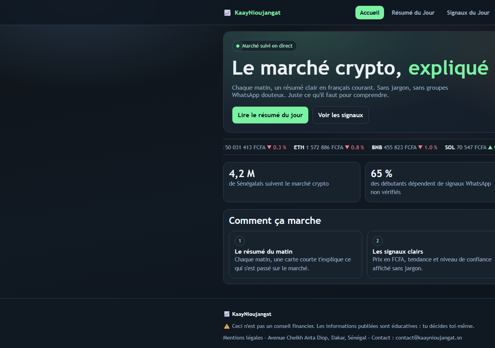<br><sub>Accueil — thème sombre</sub></td>
<td width="50%">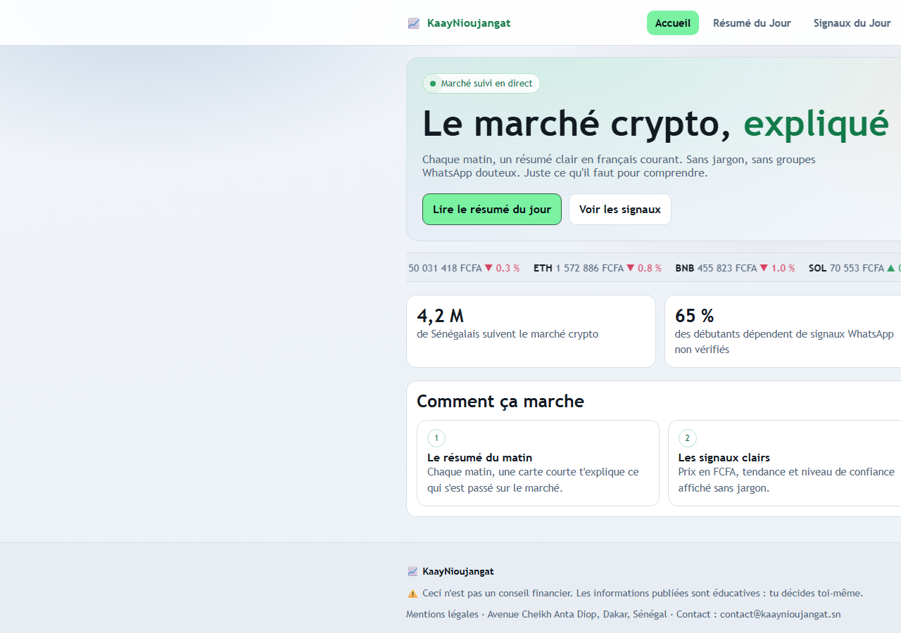<br><sub>Accueil — thème clair</sub></td>
</tr>
<tr>
<td>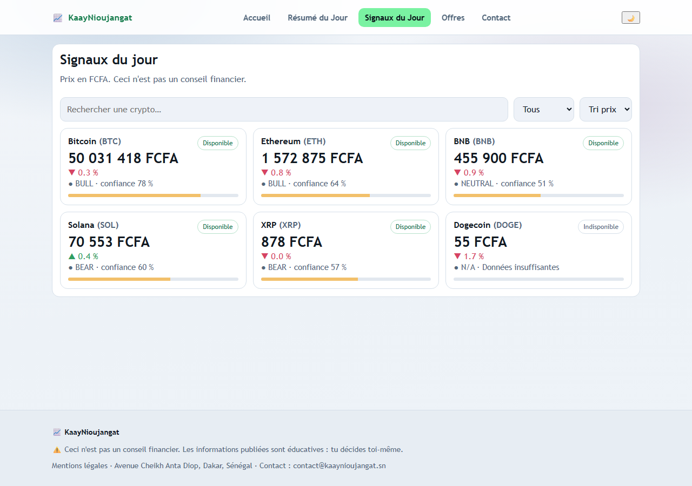<br><sub>Signaux du Jour (prix en FCFA)</sub></td>
<td>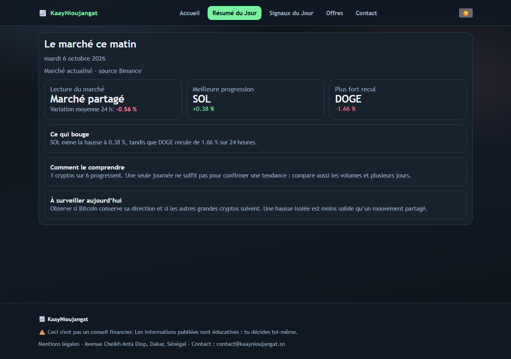<br><sub>Résumé du Jour</sub></td>
</tr>
<tr>
<td>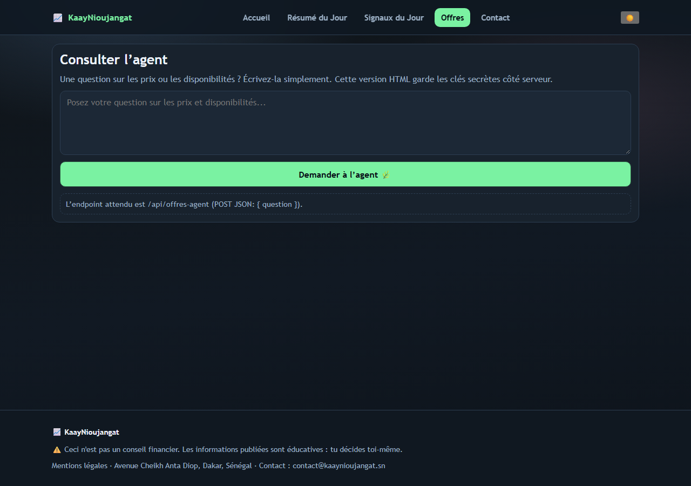<br><sub>Offres — consulter l'agent</sub></td>
<td>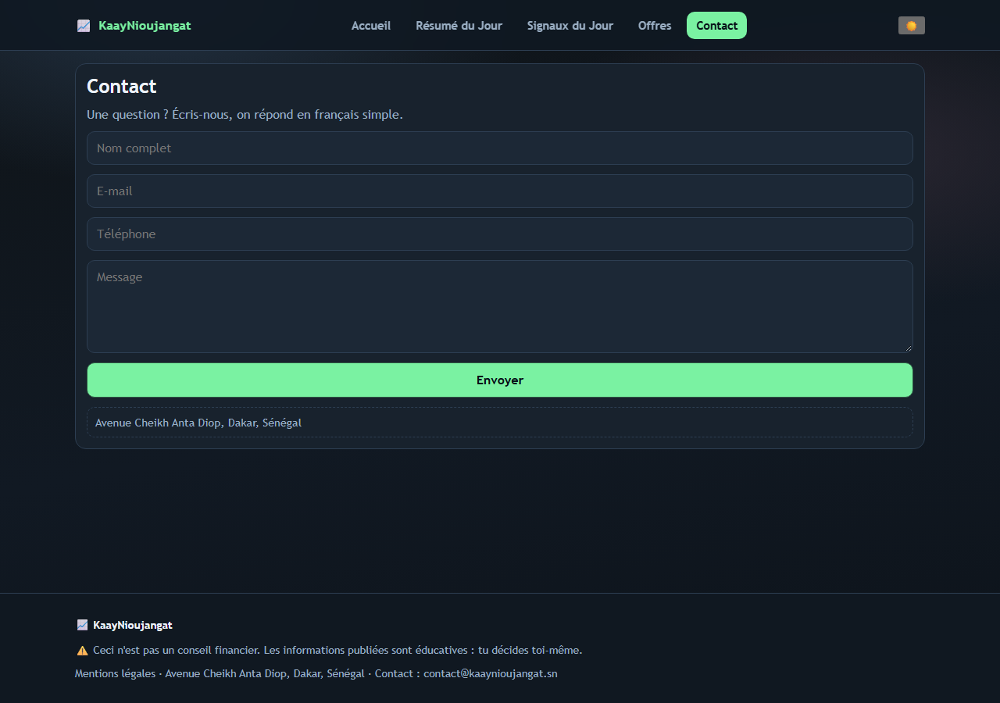<br><sub>Contact</sub></td>
</tr>
</table>

## 🎬 Publicité Google Flow (S5)

Une publicité de ~1 minute pour KaayNioujangat, produite avec Google Flow à partir de 3 personnages et de **9 scènes**.

- 📋 Plan de production complet (brief, concept, personnages, 9 scènes, captures du site, montage) : [`docs/GoogleFlow/plan-publicite-kaaynioujangat.md`](docs/GoogleFlow/plan-publicite-kaaynioujangat.md)
- 🪜 Procédure pas à pas dans Google Flow, scène par scène : [`docs/GoogleFlow/scenes-flow-pas-a-pas.md`](docs/GoogleFlow/scenes-flow-pas-a-pas.md)
- 🎥 **Vidéo de présentation (toutes les scènes assemblées) :** [`docs/GoogleFlow/All_Scenes_In_One_20261006204848.mp4`](docs/GoogleFlow/All_Scenes_In_One_20261006204848.mp4)

---

## 🧪 Atelier Claude Code adapté à KaayNioujangat

> L'atelier d'origine suit un studio fictif et un fichier `ata-card.html`. **Ici, tout est transposé à mon projet** : `ata-card.html` devient [`kaaynioujangat-html.html`](kaaynioujangat-html.html), et chaque prompt parle de KaayNioujangat (prix en FCFA, français courant, aucune donnée inventée, « pas un conseil financier »).

**Tout a été réellement exécuté** sur ma machine avec **Claude Code 2.1.292** (plan Pro), dans des dossiers de labo. Les captures du terminal sont de vraies captures de fenêtres, celles du site viennent de Chrome : **aucun écran n'est reconstitué**.

📄 **Document de rendu (PDF, 23 pages) :** [`docs/atelier-claude/atelier-claude-kaaynioujangat.pdf`](docs/atelier-claude/atelier-claude-kaaynioujangat.pdf)
📝 Source en Markdown : [`docs/atelier-claude/atelier-claude-kaaynioujangat.md`](docs/atelier-claude/atelier-claude-kaaynioujangat.md) · 📁 Fichiers produits : [`docs/atelier-claude/exercices/`](docs/atelier-claude/exercices/)

### Ce que j'ai eu à faire

| Épisode | Exercice | Résultat réel |
|---|---|---|
| **E00** | Installation et vérification | Claude Code **2.1.292**, plan Pro, aucune clé API, « No installation issues found » |
| **E01** | Premier prompt, consommation | Lancement dans un dossier de confiance, quota Pro visible avec `/usage` |
| **E02** | Mode plan, correctif, git | Plan en lecture seule → **bug trouvé à 360 px** → correctif d'une ligne |
| **E03** | Landing page sans, puis avec la skill `frontend-design` | Deux pages générées et comparées, plugin installé en portée locale |
| **E04** | `/init` et `CLAUDE.md` | 20 lignes générées → **39 lignes** propres au projet |
| **E05** | Skill de marque `/kaay-brand` | Email, post LinkedIn et flyer A4 avec la même voix |
| **E06** | Plugins Playwright et marketing | 2 concurrents analysés, 4 captures pleine page, plan marketing sourcé |

### E00 — Installation vérifiée

<table>
<tr>
<td width="50%">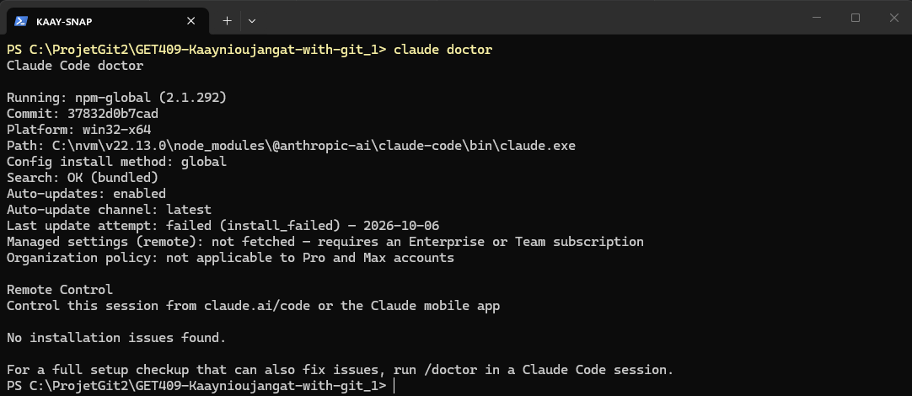<br><sub><code>claude doctor</code> : installation npm, mises à jour actives, compte Pro</sub></td>
<td width="50%">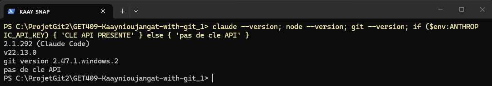<br><sub>Versions Claude / Node / Git, et pas de clé API dans l'environnement</sub></td>
</tr>
</table>

### E01 — Premier lancement et quota

<table>
<tr>
<td width="50%">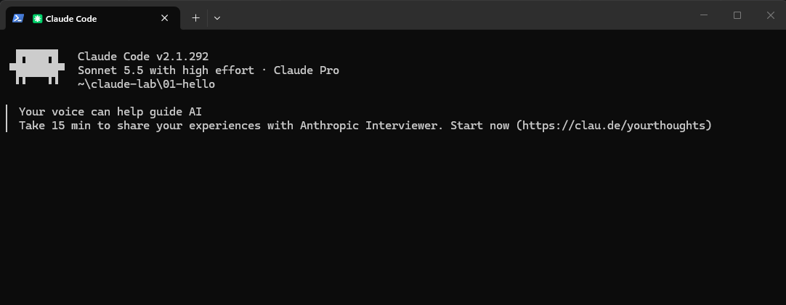<br><sub>Écran d'accueil : Claude Code v2.1.292, Claude Pro</sub></td>
<td width="50%">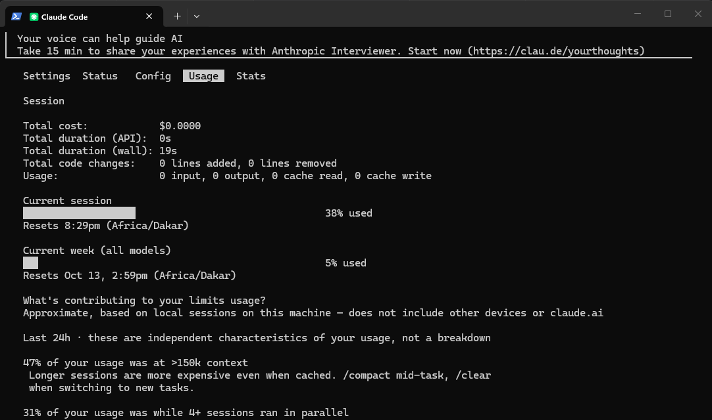<br><sub><code>/usage</code> dans une vraie session : consommation du quota Pro</sub></td>
</tr>
</table>

### E02 — Un vrai bug trouvé, planifié, corrigé

Mon thème clair/sombre existait déjà : j'ai remplacé l'exercice par un défaut réel constaté en testant à **360 px** — la page débordait (`scrollWidth` **2234 px** au lieu de 360).

1. **Plan** (`--permission-mode plan`) : Claude trouve la cause sans rien modifier — la grille `.app` n'a pas de colonne explicite, elle s'étire jusqu'à la largeur du ticker.
2. **Correctif** d'une seule ligne : `grid-template-columns: minmax(0, 1fr);`
3. **Vérification** dans Chrome : `scrollWidth` passe de 2234 à **360**.

<table>
<tr>
<td width="50%">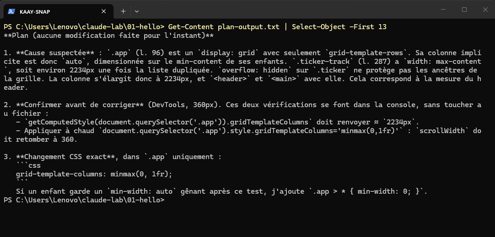<br><sub>Le plan produit par Claude (mode plan, rien n'est modifié)</sub></td>
<td width="50%">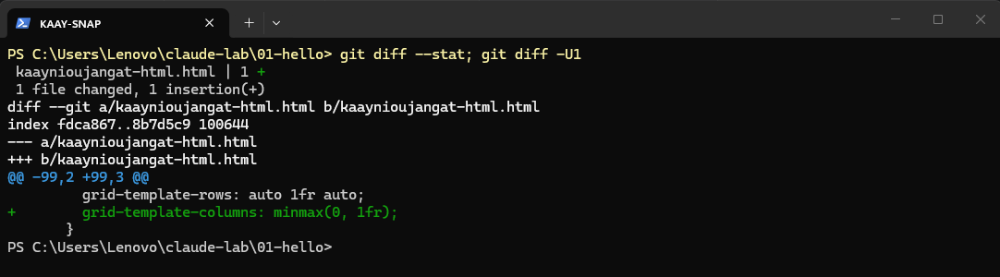<br><sub><code>git diff</code> : une seule ligne ajoutée</sub></td>
</tr>
<tr>
<td>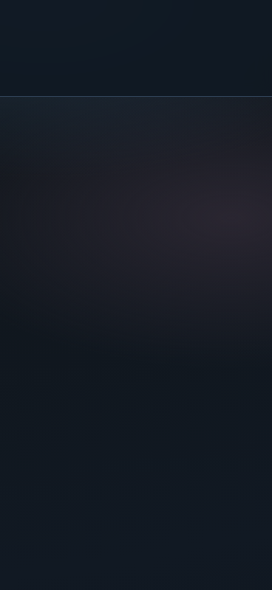<br><sub>❌ Avant : illisible à 360 px</sub></td>
<td>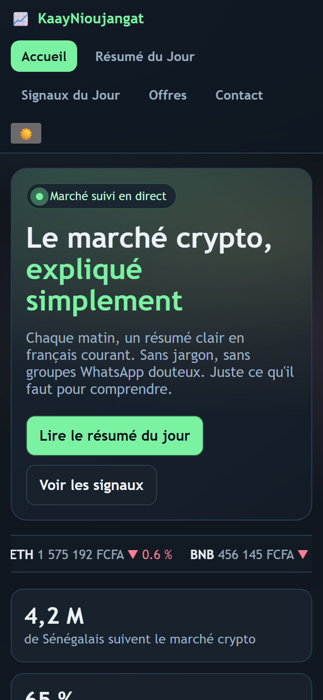<br><sub>✅ Après : la page tient dans 360 px</sub></td>
</tr>
</table>

### E03 — Avec ou sans skill ?

Même demande, deux dossiers : **V1 sans skill** et **V2 avec le plugin `frontend-design`**.

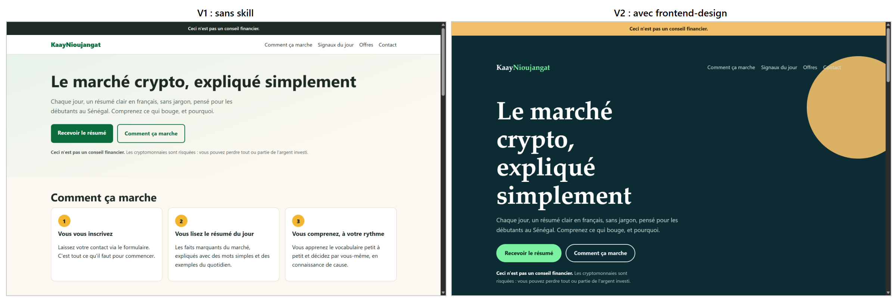

<table>
<tr>
<td width="50%">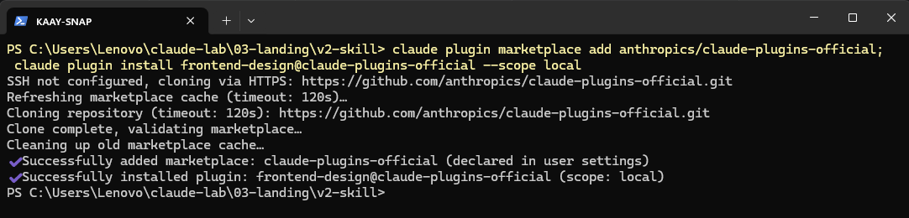<br><sub>Installation du plugin (portée locale, dossier v2 seulement)</sub></td>
<td width="50%">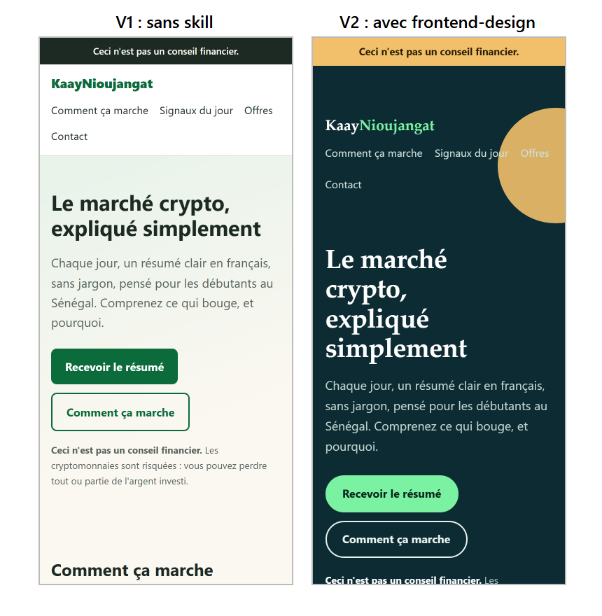<br><sub>À 360 px : les deux pages tiennent sans défilement horizontal</sub></td>
</tr>
</table>

Direction artistique de la V2 : Palatino, palette « Atlantique au crépuscule / Gorée », strakes de pirogue, mouvement coupé en `prefers-reduced-motion`.
⚠️ Défaut constaté et **non corrigé** : le « soleil » ambre de la V2 recouvre un lien du menu.

### E04 — `CLAUDE.md` du projet

`/init` produit 20 lignes ; une réécriture ciblée donne **39 lignes**, toutes propres à la page (sections, variables `:root`, un seul breakpoint à 760 px, disclaimer obligatoire à six endroits, signaux toujours marqués comme démonstration).

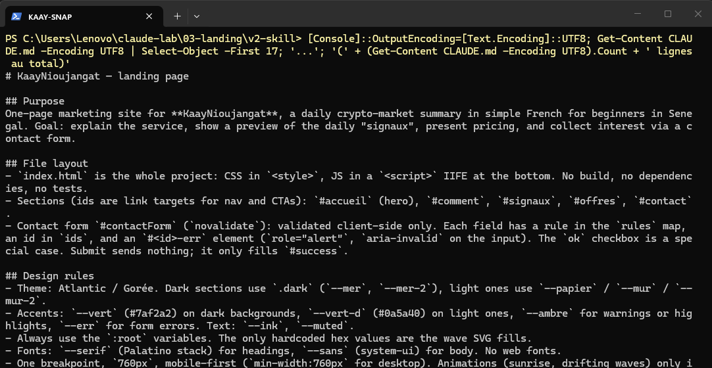

### E05 — Ma voix de marque : `/kaay-brand`

Skill personnelle construite avec les **vraies valeurs du site** : vert `#7af2a2`, ambre `#f2c06b`, fond `#0f1418`, signature « Tu décides toi-même. », rappel « Ceci n'est pas un conseil financier. ».

<table>
<tr>
<td width="33%">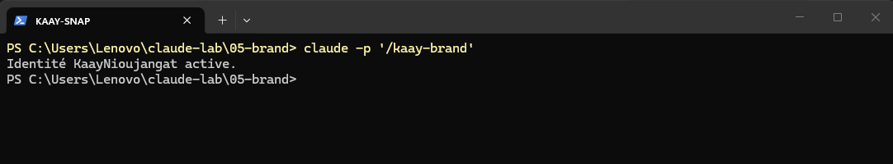<br><sub><code>/kaay-brand</code> répond « Identité KaayNioujangat active. »</sub></td>
<td width="33%">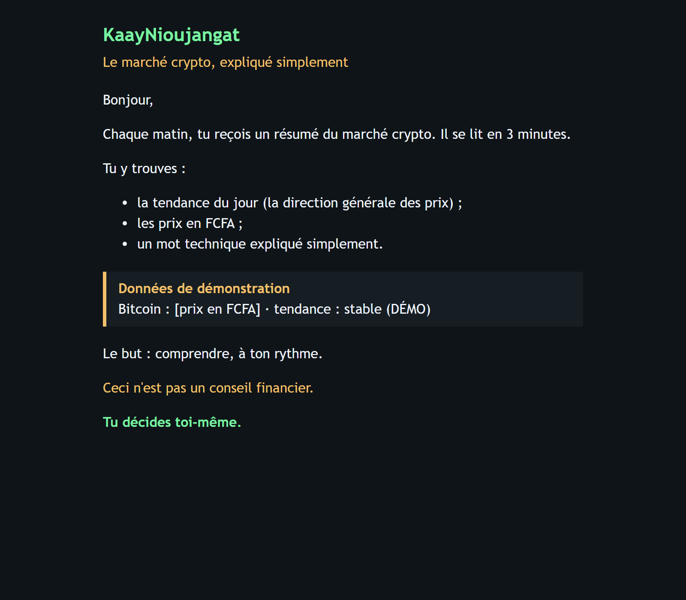<br><sub>Email du matin (données de démonstration)</sub></td>
<td width="33%">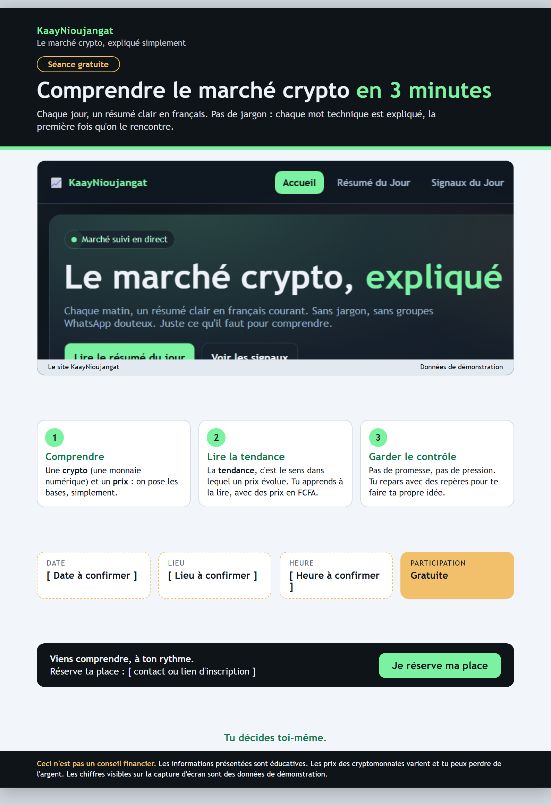<br><sub>Flyer A4 « Comprendre le marché crypto en 3 minutes »</sub></td>
</tr>
</table>

🔍 **Un défaut mesuré, puis corrigé :** le premier flyer faisait **1349 px** de contenu pour une page A4 de **1123 px** : le bouton et l'avertissement légal étaient coupés. Après correction : tout tient dans l'A4.

<table>
<tr>
<td width="50%">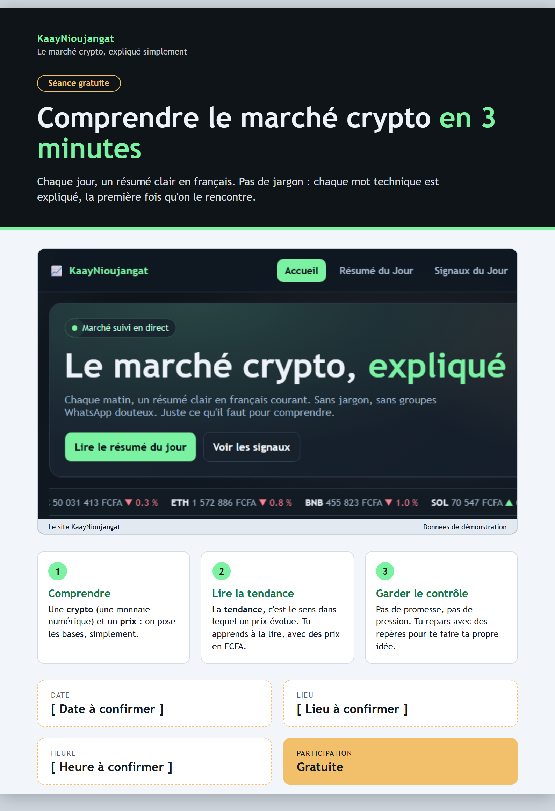<br><sub>❌ Avant : bas du flyer coupé</sub></td>
<td width="50%"><br><sub>✅ Après : avertissement visible</sub></td>
</tr>
</table>

### E06 — Plugins : Playwright et plan marketing

Playwright (navigateur piloté par Claude) a visité deux sites publics français d'information crypto, **cryptoast.fr** et **journalducoin.com** — sans connexion, sans formulaire, sans clic sur les bannières de cookies. Résultat : `competitive-analysis.md` (chaque affirmation renvoie à une capture ou une adresse, « non observé » sinon) puis `marketing-plan.html`.

<table>
<tr>
<td width="50%">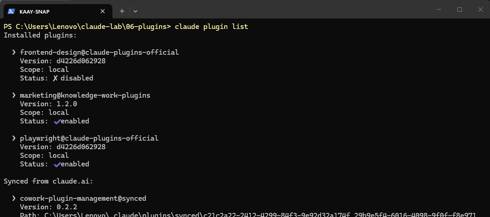<br><sub><code>claude plugin list</code> : Playwright et marketing, en portée locale</sub></td>
<td width="50%">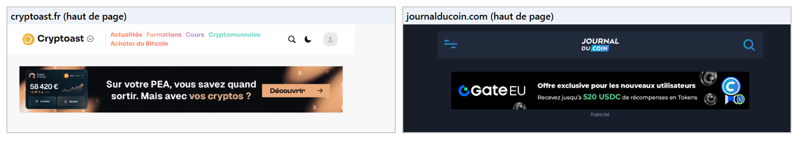<br><sub>Captures Playwright des deux concurrents (haut de page)</sub></td>
</tr>
</table>

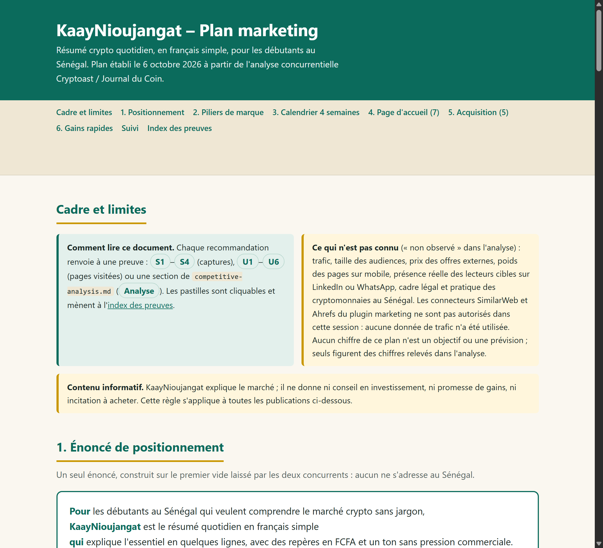

**Constats de l'analyse :** aucun des deux sites ne s'adresse au Sénégal (ni FCFA ni mobile money), tous deux placent une offre partenaire avant l'actualité, aucun prix visible. **Cinq recommandations** : résumé quotidien comme action principale · assumer l'angle ouest-africain · résumés courts et datés · rester non commercial et indépendant · page légère à une seule action.

### 🧾 Limites assumées

- Parcours **Essentiel E00 → E06** ; E07 à E14 (PromptLens, boucle Ralph, agents) non traités.
- Exercices lancés en mode non interactif (`claude -p`) sauf `/usage` ; `/rewind`, `/status` et `/model opusplan` non faits.
- La skill `/kaay-brand` a été écrite directement (le jeu de questions-réponses de l'atelier exige une session interactive).
- Le plan marketing n'utilise aucune donnée de trafic (connecteurs SimilarWeb/Ahrefs non autorisés) ; le cadre légal sénégalais reste à vérifier.

---

## 📅 Roadmap Séances

- **Séance 1 :** Empathie, problème (HMW draft), setup repo.
- **Séance 2 :** Idéation (6 Chapeaux de Bono), Value Proposition Canvas, HMW définitif, Journal de Prompts (Zero-Shot / Few-Shot / Chain-of-Thought).
- **Séance 3 :** Architecture multi-agents avec Dify — Workflow Chercheur → Rédacteur, Journal de Prompts S3, Réflexion éthique.
- **Séance 4 :** MVP no-code avec Lovable — prompt d'initialisation adapté au projet, 4 pages, publication lovable.app.
- **Séance 5 :** Page HTML KaayNioujangat (prix FCFA en direct, 5 vues, thème clair/sombre) et publicité Google Flow (9 scènes + vidéo).
- **Atelier Claude Code :** épisodes E00 à E06 réalisés et documentés (voir ci-dessus).
- **Suite prévue :** intégration MVP ↔ agent Dify + RAG (base de connaissances), pas encore réalisée.

## 📂 Structure du dépôt

```
.
├── README.md
├── kaaynioujangat-html.html                 # page HTML (livrable S5)
├── docs/
│   ├── HMW.md · vpc.md · chapeaux-bono.md · carte_empathie.pdf · fiche_equipe.pdf
│   ├── journal-prompts.md · journal-prompts-s3.md · dify-prompts-s3.md
│   ├── reflexion-ethique-s3.md
│   ├── lovable-prompt-s4.md / .pdf
│   ├── GoogleFlow/
│   │   ├── plan-publicite-kaaynioujangat.md
│   │   ├── scenes-flow-pas-a-pas.md
│   │   └── All_Scenes_In_One_20261006204848.mp4
│   └── atelier-claude/
│       ├── atelier-claude-kaaynioujangat.pdf / .md   # document de rendu
│       ├── img/                                      # captures réelles
│       ├── exercices/                                # fichiers produits (E02 à E06)
│       ├── kaay-brand/SKILL.md                       # skill de marque
│       ├── source/                                   # énoncé de l'atelier
│       └── build.mjs                                 # régénère le PDF
└── .gitignore
```

## 📄 Licence

MIT — voir [LICENSE](LICENSE).
